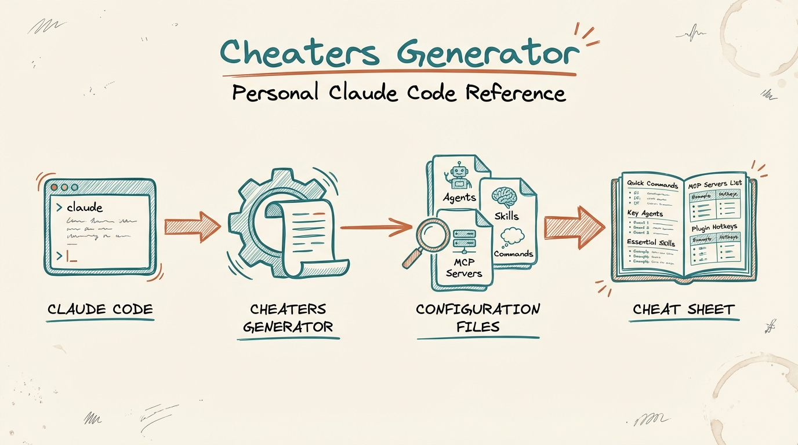
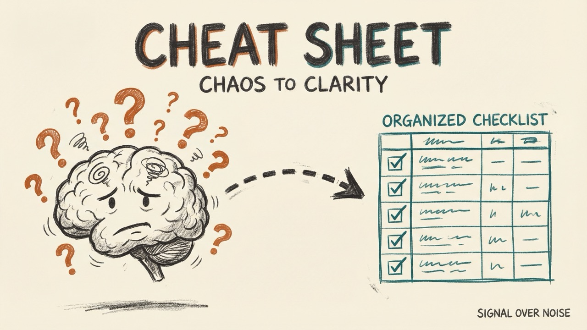
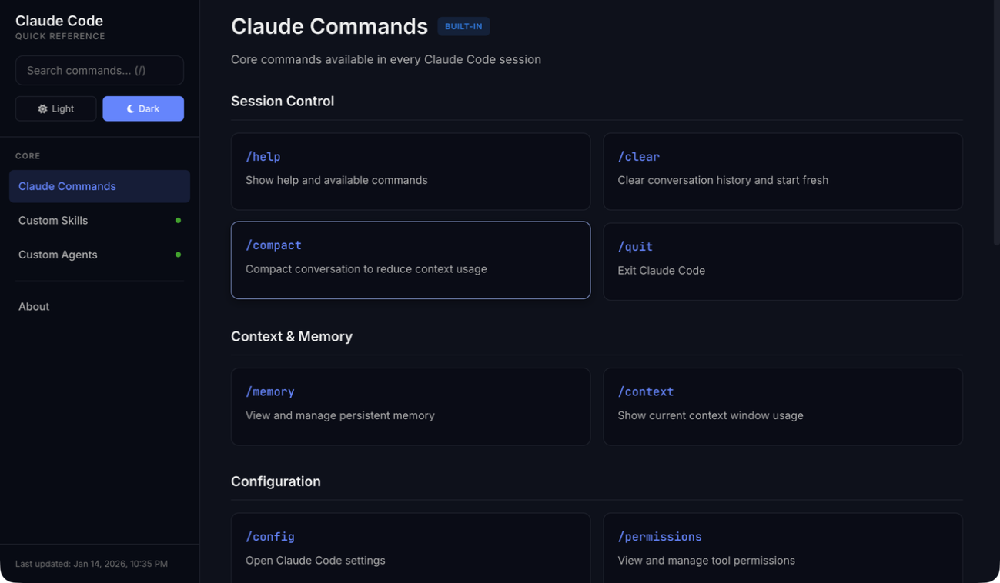
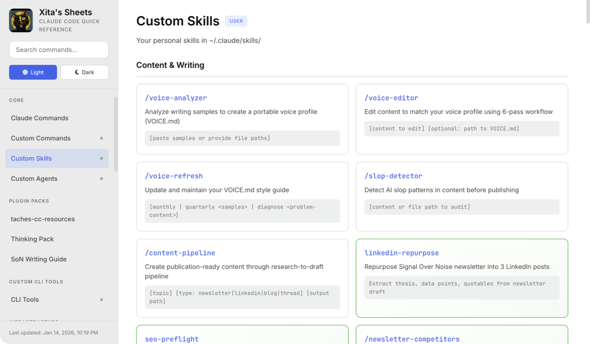

# Claude Code Quick-Reference

[](https://opensource.org/licenses/MIT)
[](https://claude.ai/code)

*Stop asking Claude what tools you have. Build a cheat sheet instead.*



Generate personalized Claude Code quick-reference systems inspired by [Brett Terpstra's Cheaters](https://github.com/ttscoff/cheaters).

## Watch It In Action

[](https://youtu.be/6yZ_3Il0nzw)

*Click to watch: I Built a Cheat Sheet for My Claude Code Setup*

## The Problem

You've built dozens of skills, agents, and MCP servers in Claude Code, but you can't remember half of them.

Sound familiar?
- "Wait, did I already build a skill for that?"
- "What was that agent called again?"
- "Which MCP servers do I actually have configured?"
- Running `/help` gets you built-in commands, not your custom tools

This plugin solves that by generating a searchable, offline quick-reference of everything you've built.

## Features

- **Modern design** with oklch() colors and smooth animations
- **Dark & light themes** with system preference detection
- **Global search** — Press `/` to search all commands across sheets
- **Keyboard navigation** — j/k, arrows, Enter to select
- **Auto-discovery** — Scans your actual configuration
- **Proper frontmatter parsing** — Extracts descriptions from skills, models from agents
- **Diff-based sync** — See exactly what changed between updates
- **LocalStorage persistence** — Remembers your last-viewed sheet and theme





## How It Works

The plugin scans your Claude Code configuration and generates HTML sheets:

| Source | Location | What Gets Extracted |
|--------|----------|---------------------|
| Skills | `~/.claude/skills/*/SKILL.md` | name, description, user-invocable |
| Agents | `~/.claude/agents/*.md` | model, tools (from frontmatter) |
| MCP Servers | `~/.claude.json` | tools, configuration |
| Plugins | `~/.claude/plugins/` | all skills from installed plugins |

The output is a standalone HTML file that works completely offline — no server needed.

## Installation

### Option 1: Plugin Install (Recommended)

```bash
# Add the marketplace
claude plugin marketplace add aplaceforallmystuff/claude-code-quickref

# Install the plugin
claude plugin install claude-code-quickref
```

Start a new Claude Code session to use the commands and skills.

### Option 2: Manual Install

```bash
# Clone the repo
git clone https://github.com/aplaceforallmystuff/cheaters-generator.git
cd cheaters-generator

# Copy skills to your Claude Code directory
cp -r skills/* ~/.claude/skills/
```

## Usage

### Generate Your Quick-Reference

```
/generate-quickref
```

Or with a custom location:

```
/generate-quickref ~/Documents/my-quickref
```

### Sync Existing Quick-Reference

Update your existing quickref with any changes to your configuration:

```
/sync-quickref
```

This will:
1. Scan current skills, agents, commands, MCP servers
2. Compare against existing sheets
3. Report a diff (Added / Removed / Changed)
4. Update only affected files
5. Rebuild main.js

### Using Your Quick-Reference

```bash
# Open directly in browser
open path/to/quickref/index.html

# Or serve locally (optional)
cd path/to/quickref && python3 -m http.server 8888
```

### Keyboard Shortcuts

| Key | Action |
|-----|--------|
| `/` | Focus search |
| `Esc` | Close search |
| `↑` / `↓` | Navigate results / sheets |
| `Enter` | Select result |
| `k` / `j` | Previous / next sheet |

## Architecture

```
your-quickref/
├── index.html              # Main HTML with navigation
├── stylesheets/
│   └── main.css            # Modern oklch() themes
├── javascripts/
│   └── main.js             # AUTO-GENERATED from sheets/
├── sheets/                 # Individual sheet files (2-12 KB each)
│   ├── builtin-commands.html
│   ├── custom-skills.html
│   ├── custom-agents.html
│   ├── mcp-*.html          # One per MCP server
│   └── ...
└── images/
    └── mascot.png          # Optional mascot image
```

### Editing Sheets

Edit individual files in `sheets/` — each is small and self-contained:

```bash
vim sheets/custom-agents.html
```

After editing, rebuild `main.js`:

```bash
node scripts/build.js
```

## Design System

The generated CSS uses modern oklch() colors following superdesign principles:

- **Typography**: Inter for body, JetBrains Mono for code
- **Colors**: oklch() color space for perceptual uniformity
- **Shadows**: Subtle, multi-layer shadows
- **Animation**: 150-400ms ease-out transitions
- **Spacing**: 4px base unit (0.25rem)

## Frontmatter Parsing

### Skills (SKILL.md)

```yaml
---
name: skill-name
description: What this skill does
user-invocable: true
---
```

### Agents (.md files)

```yaml
---
model: opus
tools:
  - Read
  - Write
---
```

The model field is displayed as "Model: Opus/Sonnet/Haiku" in the quick-reference.

## Requirements

- Claude Code CLI installed
- Node.js (for build script)
- A browser (for viewing the quick-reference)

## Contributing

See [CONTRIBUTING.md](CONTRIBUTING.md) for guidelines.

## License

[MIT](LICENSE)

## Author

Jim Christian — [jimchristian.net](https://jimchristian.net)

---

### Related Projects

- [Brett Terpstra's Cheaters](https://github.com/ttscoff/cheaters) — The original inspiration
- [Claude Agent Borg](https://github.com/aplaceforallmystuff/claude-agent-borg) — Assimilate external Claude Code setups
- [Minervia](https://github.com/aplaceforallmystuff/minervia) — Claude Code + Obsidian starter kit
